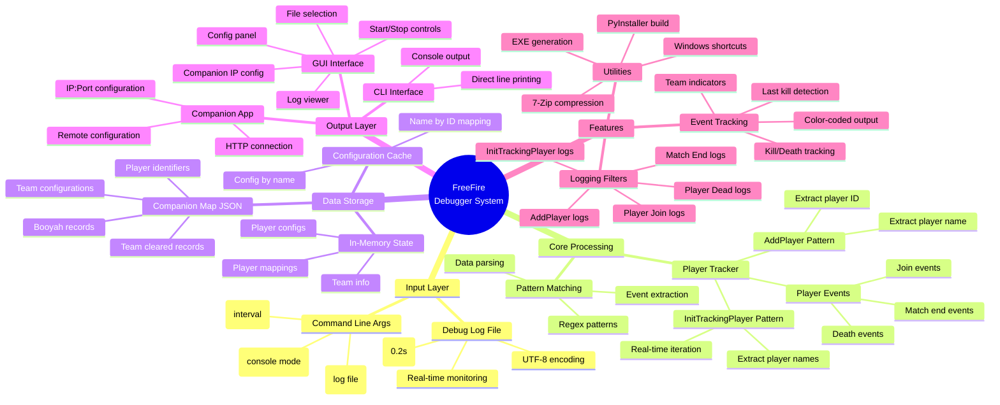

# FreeFire InitTrackingPlayer Debugger

## Sử dụng / Usage

### GUI Mode (Mặc định):
```bash
python main.py
```

### CLI Mode:
```bash
python main.py --cli path/to/debug.log --poll 0.2
```

### Build EXE:
```bash
python build_exe.py
```

---

## Cách Thức Hoạt động / How It Works



## Tổng Quan / Overview

Dự án này là một công cụ **debug và theo dõi game FreeFire** dựa trên phân tích log file. Hệ thống có khả năng theo dõi real-time các sự kiện trong trò chơi và cung cấp giao diện để xem và cấu hình.

This project is a **FreeFire game debugging and tracking tool** based on log file analysis. The system can monitor real-time game events and provide an interface for viewing and configuration.

---

## Kiến Trúc / Architecture

### 1. **Entry Point** (`main.py`)
- Phân tích command-line arguments
- Lựa chọn giữa CLI hoặc GUI mode
- Gọi `player_tracker.py` cho xử lý dữ liệu
- Gọi `gui.py` cho giao diện đồ họa

**Functions:**
- `parse_args()` - Xử lý arguments
- `_run_cli()` - Chạy CLI mode
- `main()` - Hàm chính

### 2. **Player Tracker** (`player_tracker.py`)
Core logic để theo dõi người chơi từ debug log.

**Regex Patterns:**
```python
INIT_TRACKING_PATTERN   → [InitTrackingPlayer] \d+ -> (playerName)
ADD_PLAYER_PATTERN      → [UIModelSpectator] AddPlayer id(\d+),name(\S+)
```

**Main Functions:**
- `follow_lines()` - Đọc file log theo real-time với polling
- `iter_player_names()` - Trích xuất tên người chơi
- `parse_add_player_line()` - Phân tích AddPlayer events
- `iter_add_player_events()` - Lặp qua AddPlayer events

### 3. **GUI Interface** (`gui.py`)
Giao diện Tkinter để quản lý và theo dõi.

**Components:**
| Component | Chức năng |
|-----------|---------|
| Path Entry | Chọn file debug log |
| Poll Entry | Cấu hình khoảng thời gian polling (giây) |
| Companion IP | Địa chỉ IP:Port của Companion app |
| Start/Stop | Bắt đầu/dừng tracking |
| Config List | Danh sách các configuration |
| Log Viewer | Hiển thị các events với màu sắc |
| Filters | Tùy chọn các loại log cần hiển thị |

**Log Colors:**
- 🔵 **Blue** - Team indicators
- 🟢 **Dark Green** - Killer (người giết)
- 🔴 **Dark Red** - Victim (nạn nhân)
- 🟠 **Dark Orange** - Team cleared

### 4. **Build System** (`build_exe.py`)
Biên dịch project thành EXE file đơn lẻ.

**Features:**
- Tự động cài đặt PyInstaller nếu cần
- Tạo shortcuts trên Desktop
- Nén file với 7-Zip
- Tạo installer

### 5. **Configuration** (`companion_map.json`)
Lưu trữ mapping cho:
- **Teams** (Đội chơi) - ví dụ: HEV, WAG, FL
- **Players** (Người chơi) - ví dụ: HEV.ALAN, WAG.TQUY
- **Booyah** (Chiến thắng) - ví dụ: BOOYAH HEV
- **Team Cleared** (Đội bị tiêu diệt) - ví dụ: TEAM BRU CLEARED

---

## Quy Trình Hoạt động / Workflow

### Scenario 1: GUI Mode (Mặc định)

```
1. Chạy main.py
   ↓
2. Giao diện GUI khởi động
   ├─ Load companion_map.json
   └─ Chợn file debug log
   ↓
3. Click "Start" button
   ├─ player_tracker.follow_lines() bắt đầu
   ├─ Đọc file log real-time
   ├─ Áp dụng regex patterns
   └─ Gửi events đến GUI
   ↓
4. GUI xử lý events
   ├─ Cập nhật Config List
   ├─ Cập nhật Log Viewer
   └─ Gửi request đến Companion IP (nếu cần)
   ↓
5. Click "Stop" button → Dừng tracking
```

### Scenario 2: CLI Mode

```
1. Chạy main.py --cli [path] [--poll 0.2]
   ↓
2. Đọc file log với follow_lines()
   ↓
3. Trích xuất player names với iter_player_names()
   ↓
4. In từng player name ra console
   ↓
5. Ctrl+C để dừng
```

---

## File Structure

```
debuger/
├── main.py                  # Entry point
├── build_exe.py            # Build to EXE
├── app/
│   ├── gui.py              # GUI interface
│   ├── player_tracker.py   # Core tracking logic
│   ├── main.py             # App main entry
│   └── companion_map.json  # Config mappings
└── [Test files & logs]
```

---

## Công Nghệ Sử dụng / Technologies

- **Python 3.8+**
- **Tkinter** - GUI Framework
- **Regex** - Pattern matching
- **Threading** - Real-time processing
- **PyInstaller** - EXE compilation
- **7-Zip** - Compression

---

## Cấu hình / Configuration

### Poll Interval
- Mặc định: 0.2 giây
- Càng nhỏ → Theo dõi càng nhanh (tiêu tốn CPU nhiều hơn)
- Càng lớn → Theo dõi chậm hơn (tiêu tốn CPU ít hơn)

### Companion IP
- Mặc định: 127.0.0.1:8000
- Dùng để gửi config tới ứng dụng Companion
- Để trống để bỏ qua

---

## Mở Rộng / Extension

### Thêm Pattern Mới
Chỉnh sửa `player_tracker.py` để thêm regex pattern:
```python
NEW_PATTERN = re.compile(r"your_pattern_here")
```

### Thêm Log Filter
Thêm checkbox trong `gui.py` `_build_ui()`:
```python
new_check = tk.Checkbutton(logs_filters, text="Your Event", variable=self.log_new_var)
```

### Thêm Configuration
Cập nhật `companion_map.json`:
```json
{
  "your_category": {
    "YOUR_KEY": [1, 0, 0]
  }
}
```

---

## Troubleshooting

| Vấn đề | Giải pháp |
|--------|----------|
| File log không tìm thấy | Kiểm tra đường dẫn đầy đủ (absolute path) |
| Không có events hiển thị | Kiểm tra poll interval, có thể file log chưa được viết |
| GUI không hiển thị | Cài đặt tkinter: `pip install tk` |
| EXE build fail | Cài đặt PyInstaller: `pip install pyinstaller` |
| Companion connection fail | Kiểm tra IP:Port, đảm bảo Companion app đang chạy |

---

## License

Internal Tool - DebugFFire Project

---

**Last Updated:** 2026-05-13
